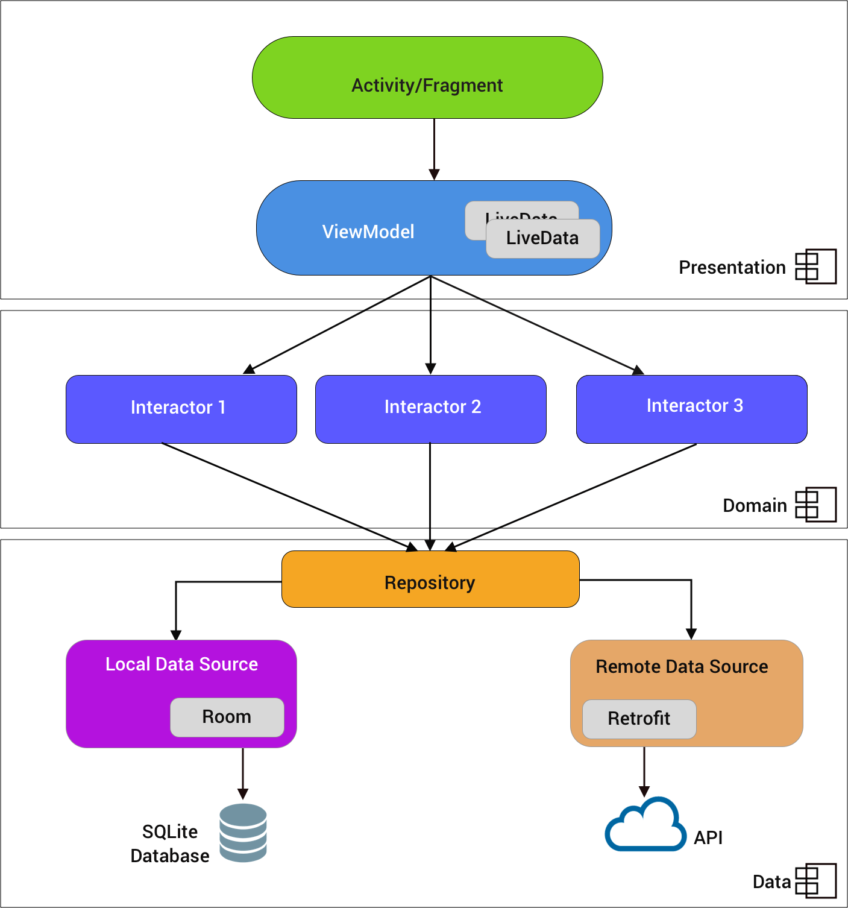

# Kotlin Template

[Short project description]

## Day-to-day work

1. All new work resigns in `feature/*` branches. If some new interfaces were introduced, remember to cover them with unit-tests.
2. After your work on the feature branch is complete, open the PR and ask someone who is working on this project (or worked previously) to review it.
3. When PR is opened, Bitrise will automatically run all the code quality checks and unit-tests and will generate a report.
4. When PR is reviewed, merged and all the checks have passed, remember to make a new builds.

> Pro-tip: When opening pull-requests and/or creating branches remember to reference the JIRA issue/ticket

## Enterprise level projects

### Code quaulity
Enterprise level projects also contain `lintrules` module with custom linting rules to maintain code quaulity. Moreover, each module uses `detect` and `klint` gradle plugins to maintain code style and cleanliness. Every pull request made, will launch these checks to make sure develop/master branches are always "clean" and release-ready. You can also run these checks manually using `gradle` commands like so:
```
./gradlew detekt
./gradlew lint
./gradlew ktlintCheck
```

### Unit-test coverage
Enterprise level project are required to have **80% code-coverage** with the most important piece being application's **business logic** (100% coverage) and Presentation/UI layers. Android uses `JaCoCo` gradle plugin to generate coverage reports for all the modules and ties them all together. If there are some files you wish to exclude from coverage-report (Dagger files for example) you can update `jacoco.gradle` to with additional files like so:
```groovy
def toExclude = ['**/R.class',
                 '**/R$*.class',
                 '**/*$$ViewBinder*.*',
                 '**/injection/*',
                 '**/**Builder.*'
```
When it comes to writing unit-test itself please refer to our extensive guide for unit testing: https://github.com/nodes-android/guidelines/blob/master/unittesting.md

## Android Project

Android project is based on our newest template for client projects that uses [Google's ViewModels](https://developer.android.com/topic/libraries/architecture/viewmodel) with a lightweight ViewState approach, similar to MVI and  follows multi-modular approach to support clean architecture principles.


### Build Configuration
Due to the modular architecture approach top-level `build.gradle` should provides all dependencies versions, android API level,  and API keys that could be shared across different modules using extensions.
```groovy

ext.sdks = [
          compileSdkVersion: [latest SDK version],
          buildToolsVersion: [latest Build Tools version]
          minSdkVersion    : 21,
          targetSdkVersion : [latest SDK version]
    ]

ext.versions = [
         kotlin             : '1.3.41',
         coroutines         : '1.3.0-M2',
         ...
      ]
```
When it comes to flavours, projects usually have two application variants, that are defined in the `app` build.gradle. Thats also the place where all flavour-dependent variables should be specified
  - `stating` - points to test environment, builds are debuggable
  - `production` - points to production environment, signed with the the release keystore


### Flow of control

<p align="center">
  
</p>


Example:
1. View subscribes to ViewModel's LiveData instance(s).
2. User clicks a button that loads a list of posts in a view.
3. OnClickListener executes a Interactor/UseCase asynchronously in the business logic layer.
4. The Interactor runs in the background accessing a post repository which fetches a list of posts
5. ViewModel gets result from the Interactor and updates local view state, which triggers a LiveData update
6. View is updated since it's observing the LiveData instance from our ViewModel.


### Modules
Android project follows multi-modular approach to support clean architecture principles

#### App
Main entry point with shared Application logic

#### Data
Contains data class models, repositories and network logic. Retrofit2/OkHttp3 is used for network logic.

```kotlin
class RestPostRepository @Inject constructor(private val api: Api) : PostRepository {
    @Throws(RepositoryException::class)
    override suspend fun getPosts(cached: Boolean): List<Post> {
        val response = api.getPosts().execute()
        if (response.isSuccessful) {
            return response.body()
                ?: throw(RepositoryException(
                    response.code(),
                    response.message()
                ))
        }
        throw(RepositoryException(response.code(), response.message()))
    }
}
```

#### Domain
General shared business logic with interactors, extensions, managers, various utility code.

An interactor usually returns a result via a suspend method. You can model the Result class as you like:

```kotlin
sealed class Result<V> {
    sealed class Success<V> : Result<V>() {
        data class StillFetching(val data: V) : Success<V>()
        data class Cached(val data: V) : Success<V>()
        data class FreshData(val data: V) : Success<V>()
        object NoData() : Success<V>()
    }

    // Error states
}
```
Or the more simple version:
```kotlin
sealed class Result {
    data class Success(val data: SomeData) : Result()
    data class Error(val e: Exception): Result()
}
```

Interactors are the link to the outer layers of the domain layer, i.e. contacting the API or fetching/saving various state.

```kotlin
class FetchPostsInteractor @Inject constructor(
    private val postRepository: PostRepository
) : BaseAsyncInteractor<List<Post>> {

    override suspend fun invoke(): List<Post> {
       return postRepository.getPosts()
    }
}
```

#### Presentation
Unsurprisingly holds the UI with matching ViewModels. This is usually the module branched out from if needed. Presentation layer provides various extension functions for your interactors so you could use different approaches when updating your `viewState`.

##### Result Interactor
`ResultInteractor` will handle exception handling and produce a `CompleteResult`
```kotlin
// Some random ViewModel

// Wrap your basic intractors as a Result Interactor
private val resultInteractor = getPostsInteractor.asResult()

fun fetchPosts() = viewModelScope.launch(Dispatchers.Main) {
       state = mapResult(Loading())
       val result = withContext(Dispatchers.IO) { resultInteractor.invoke() }
       state = mapResult(result)
   }
```

##### LiveData Interactor
`LiveDataInteactor` will produce a `LiveData<InteractorResult<T>>` that you can add as an additional state source

```kotlin
// Wrap your basic interactor as LiveData
private val liveDataInteractor = postsInteractor.asLiveData()

   fun fetchPosts() = viewModelScope.launch(Dispatchers.Main) {
       addStateSource(resultInteractor.liveData) { state = mapResult(it) }
       withContext(Dispatchers.IO)  {
           resultInteractor()
       }
   }
```

##### Flow Interactor
`FlowInteractor` will produce a `Flow` to which you can subscribe to and map state accordingly
```kotlin

// Wrap your basic interactor as a Flow
private val flowInteractor = getPostsInteractor.asFlow()

fun fetchPosts() = viewModelScope.launch(Dispatchers.Main) {
         resultInteractor.invoke()
             .flowOn(Dispatchers.IO)
             .collect { state = mapResult(it) }
    }
```

##### RxInteractor
`RxInteractor` will produce a `Flowable` that you can observe using `RxJava/RxKotlin`
```kotlin
private val rxInteractor = postsInteractor.asRx()
private val cd = CompositeDisposable()

   fun fetchPosts() = viewModelScope.launch {
       cd.add(rxInteractor.observe()
           .observeOn(AndroidSchedulers.mainThread())
           .subscribeOn(Schedulers.io())
           .subscribe { state = mapResult(it) })
       rxInteractor.invoke()
   }
```
> Don't forget to clear `CompositeDisposable` in `onCleared()`


#### Error Handling
`ViewErrorController` is used to handle exceptions received from the intractors in the `ViewModel` and present the human-readable error message in the ui layer (i.e `Fragment`/`Activity`).
When using it in `ViewModel`, `ViewErrorController` can be used to map throwable to a `ViewError` instance. You can also tweak `ViewErrorController` implementation to provide your own exception handling and etc.
```kotlin
private fun mapResult(result: InteractorResult<List<Post>>): SampleViewState {
        return when (result) {
            is Fail -> state.copy(
                viewError = SingleEvent(ViewErrorController.mapThrowable(result.throwable)),
                isLoading = false
            )
        }
    }
```
`ViewError` object is then can be used in Fragment/Activity to display Error Dialog or a Snackbar
```kotlin
private fun showErrorMessage(state: SampleViewState) {
       defaultErrorController.get().showErrorSnackbar(requireView(), state.viewError?.consume() ?: return) {
           viewModel.fetchPosts()
       }
   }
```

Views are the consumers of the ViewModel's exposed LiveData. We want the view to be as dumb and small as possible, so only put UI code here

```kotlin
override fun onCreate(savedInstanceState: Bundle?) {
    // ...
    viewModel.viewState.observeNonNull(this) { state ->
        showLoading(state)
        showPosts(state)
        showErrorMessage(state)
    }
    viewModel.loadPosts()
}

private fun showPosts(state: MainActivityViewState) {
    postsTextView.text = state.posts.joinToString { it.title + System.lineSeparator() }
}

private fun showLoading(state: MainActivityViewState) {
    postsProgressBar.isVisible = state.isLoading
}

private fun showErrorMessage(state: MainActivityViewState) {
    state.errorMessage?.let {
        if (it.consumed) return@let
        Snackbar.make(
            postsTextView,
            it.consume() ?: Translation.error.unknownError,
            Snackbar.LENGTH_SHORT
        )
    }
}
```

## Injection

This project is using Dagger for injection and scoping. Dagger is an annotation based dependency injection, which computes the dependency graph at compile time and verifies that everything is correctly injected at runtime.

Dagger works by defining `@Component`s that hold the scope and lifetime of objects it creates. Each `@Component` can depend on other `@Component`s by being a `@Subcomponent`.

### Modules

In Dagger Modules are the way to specify _how_ objects are created, where components are the once who decides the lifetime of those objects.

There are different approaches to do this, given this class:
```kotlin
class RestCityRepository @Inject constructor(
        private val api: Provider<Api>,
        private val gson: Gson
) : CityRepository {
    // ...
}
```

1) Full declaration in module via `@Provides`

```kotlin
@Provides
fun provideCityRepository(val api: Provider<Api>, val gson: Gson): CityRepository {
    return RestCityRepository(api, gson)
}
```

2) `@Bind`s and defining dependencies at implementation site

```kotlin
@Binds
abstract fun bindCityRepository(cityRepository: RestCityRepository): CityRepository
```

By method 2 we avoid having to mirror constructor dependencies and only have to define what implementation of the `CityRepository` we want to inject where needed.


### Scoping

We define scopes via the components _or_ via scope annotations. In Careem we have two modes - component scope and @AppScope, which is similar to a singleton.

If we wanted RestCityRepository to be a singleton, all we had to do was mark it as @AppScope;
```kotlin
@AppScope
class RestCityRepository @Inject constructor(
        private val api: Provider<Api>,
        private val gson: Gson
) : CityRepository {
    // ...
}
```


## Integrations
List of important 3d party APIs and SDKs that are used in this project


## Live Templates
The Kotlin template comes supported with a its own set of live templates which can be found at

https://github.com/nodes-android/androidstudio-livetemplates

It should make generating the boilerplate for activities and fragments easy.

## Nodes Architecture Library
The Template uses components from our Architecture library so be sure to read up on how that is used as well

https://github.com/nodes-android/nodes-architecture-android

## Inspired from the following sources:
- [Clean Architecture by Uncle Bob](http://blog.8thlight.com/uncle-bob/2012/08/13/the-clean-architecture.html)
- [Some dudes android implementation](https://medium.com/@dmilicic/a-detailed-guide-on-developing-android-apps-using-the-clean-architecture-pattern-d38d71e94029)
- [Some other dudes implementation](https://fernandocejas.com/2014/09/03/architecting-android-the-clean-way)
